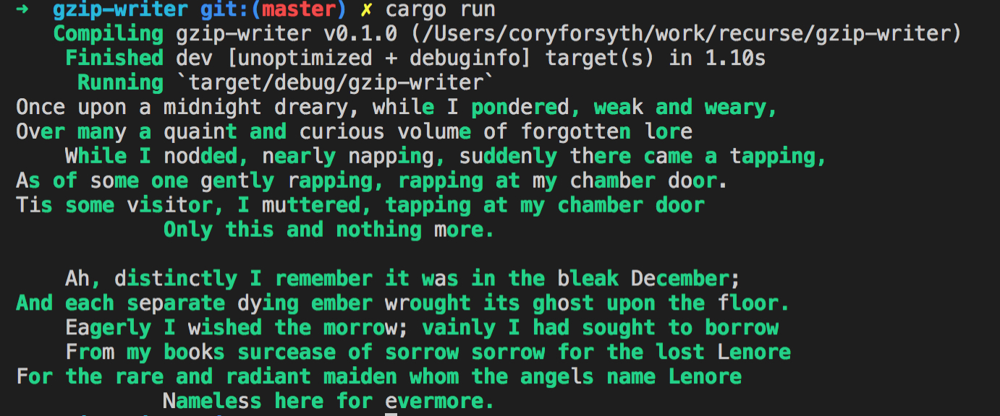

Run-length encoding testing...

Inspired by a friend at Recurse.

Takes an input string and scans through it. At each index, looks through the input-so-far for a matching char, and then walks forward at both spots to determine how long the current position matches a substring in the input-so-far.

Looks sort of like this:

# Possible todos:

- Allow specifying a minimum match length
- Skip space characters when considering matches
